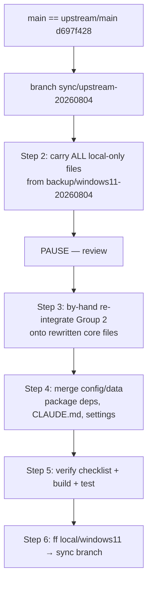

# Upstream Sync Plan — local/windows11 ← upstream/main (2026-08-04)

> ## 🛑 METHOD INVALIDATED — 2026-08-04
> Investigation revealed this is **not a sync — it is a v1→v2 major migration.**
> - `local/windows11` = **v1.2.47**; `upstream/main` = **v2.1.54** (ground-up rewrite).
> - v2 deleted the files our customizations live in (`src/ipc.ts`, `src/db.ts` gone) and replaced the architecture: entity model, two-DB sessions, **"everything is a message — no IPC"**, OneCLI baked in, channels as skill-branches.
> - **A merge / rebase / file-reintegration cannot work** — you can't re-apply IPC-based features onto an architecture that removed IPC.
> - Correct path = the official migration: `migrate-v2.sh` + `/migrate-from-v1` skill (or the `migrate-nanoclaw` skill for intent-based customization replay). See "Decision" section at bottom.
> - The **WO verification below is still valuable** — it's the catalog of customizations that a v2 migration must re-implement (mostly re-architected, not copied).

**Original (now-invalid) goal:** Bring 1635 upstream commits into `local/windows11` without losing any Windows/Cortana customizations. Uses `WO-20260803-001` (verified below) as the must-preserve checklist.

**Backup (escape hatch):** tag `backup/pre-upstream-sync-20260804` + branch `backup/windows11-20260804`, both at `327f7805`.

## Divergence

| | Count |
|---|---|
| Common ancestor | `3608f052` (~116 days old) |
| Local commits not upstream | 73 |
| Upstream commits not local | 1635 |
| Files both sides modified (conflict surface) | 18 |

`main` has already been fast-forwarded to `upstream/main` (`d697f428`), so the sync target is local `main`.

## WO-20260803-001 verification (checked against real `src/`, 2026-08-04)

8 of 9 claims accurate. One prose defect found and corrected.

| # | File | Feature to preserve | Verdict |
|---|------|--------------------|---------|
| 1 | `channels/telegram.ts` | `OLLAMA_HOST \|\| 'http://localhost:11434'` + plain `MODELS.vision` | ⚠️ WO prose inverted — keep `localhost:11434`, do NOT switch to `host.docker.internal` |
| 2 | `channels/telegram.test.ts` | `reply: vi.fn()` in mock ctx | ✅ |
| 3 | `container-runner.ts` | usage struct (56–63) + `OLLAMA_HOST` inject (282–283) | ✅ |
| 4 | `credential-proxy.ts` | resetAt persist, `readPersistedResetAt`, `refreshOAuthToken` 30-min loop | ✅ |
| 5 | `index.ts` | `detectAuthMode` import + cross-process `.lock` file guard | ✅ |
| 6 | `ipc.ts` | `callGWorkspaceMcpTool` / GWorkspace MCP (no legacy spawn) | ✅ |
| 7 | `ollama-config.ts` | gemma4:12b / qwen3:14b / phi4-mini-reasoning / granite4.1 + `GROUPS_DIR` | ✅ |
| 8 | `task-scheduler.ts` | `captureAgentRunnerUsage` + `gmail_scan_7am/7pm` | ✅ |
| 9 | `ollama-classifier.ts` | clone-only, NOT in canonical — leave out | ✅ |

**Correction:** WO §3.1 prose attributes the clone's `host.docker.internal` + `OLLAMA_VISION_MODEL` override to canonical. Reality: canonical intentionally uses `localhost:11434` (Telegram handler runs in the host process, not a container).

## Feature groups for the sync

**Group 1 — local-only files (no upstream counterpart; carry over wholesale, zero conflict):**
`credential-proxy.ts` (+test), `ollama-config.ts`, `conversation-queue.ts`, `channels/telegram.ts` (+test), plus all other files present in `local/windows11` but absent in `upstream/main` (agent-runner MCP stdio, kb-ingest, inbox-pipeline, Windows startup scripts, skills, docker-compose, notion-mcp, etc.). `ollama-classifier.ts` is clone-only and excluded.

**Group 2 — features embedded in files upstream rewrote (by-hand re-integration):**
`index.ts`, `ipc.ts`, `container-runner.ts`, `task-scheduler.ts`, plus other overlap files (`config.ts`, `container-runtime.ts`, `group-queue.ts`, `db.ts`, `channels/index.ts`, `container/Dockerfile`).

## Design fork (decided)

Keep the **credential proxy** (OAuth refresh + token tracking); **skip upstream's OneCLI gateway**. Preserving the local feature set requires it.

## Method — reintegrate onto a fresh branch

Starting from `main` guarantees all 1635 upstream features are present by construction; each local feature is then re-added deliberately, so nothing is silently dropped in either direction.

## Verification checklist (before cutover)

- [ ] telegram.ts keeps `localhost:11434` + plain vision model
- [ ] credential-proxy `refreshOAuthToken` + resetAt persistence present
- [ ] index.ts `detectAuthMode` + `.lock` guard present
- [ ] ipc.ts GWorkspace MCP client present, no legacy `spawn`
- [ ] ollama-config newer model defaults + `GROUPS_DIR`
- [ ] task-scheduler `captureAgentRunnerUsage` + `gmail_scan_7am/7pm`
- [ ] container-runner usage struct + OLLAMA_HOST inject
- [ ] group-queue synchronous `state.active = true` guard at all call sites
- [ ] `isDirectRun` uses `path.resolve()`; channel autodiscovery detects `.ts`
- [ ] exports: `CREDENTIAL_PROXY_PORT`, `CONTAINER_HOST_GATEWAY`, `applyCredentialProxyEnv`
- [ ] `npm run build` clean; `npm test` (2 known Windows failures expected)
- [ ] container rebuild + restart + live message credential check

## Rollback

`git branch -f local/windows11 backup/windows11-20260804` (or checkout the tag). Backup is untouched throughout.
